# ABC 플랫폼 매뉴얼 (rfems.com/abc_manual)

- 원본: https://rfems.com/abc_manual/index.php (fullPage.js 단일 페이지, 앵커 슬라이드 36개)
- 수집: Firecrawl scrape → 슬라이드별 텍스트 추출 + 이미지 58개 다운로드 → tesseract(kor+eng, 반전 전처리) OCR

---

## #slide0

ABC
 플랫폼 매뉴얼
 AI, Big Data, Cloud-based
Energy Integrated Management System
 HOMEPAGE : rfems.comTEL : 1661-5441
Fax : 051-980-6101
Email : rfems@rfems.com
 본사 및 기술부 : 부산광역시 강서구 명지국제2로28번길 8 더프라임 606 ~ 608호

### 이미지: `0_logo.png`


<details><summary>OCR 텍스트</summary>

```
(6 (주)한국미래메너지

Korea Future! ‘Energy:
```

</details>

---

## #slide1 — 목차

대시보드
 대시보드 위젯
 대시보드 전력메인
 피크관리
 피크상태
 부하상황판
 DC 제어설정 
 DC 그래프
 전력사용보고서
 피크 15분 전력보고서
 피크제어이력
 전력사용량
 전력사용량보기
 소비량예측
 절감효과
 계통감시
 계통감시
 공정별 에너지계통
 공정별 에너지계통 설정
 설비관리
 주요설비설정
 주요설비이용률
 주요설비부하율
 설비제어
 최적화제어
 최적화제어이력
 냉난방제어 
 비교분석
 목표대비 비교분석
 개별센서관리
 보고서
 종합보고서
 전력요금보고서
 온실가스배출보고서
 기간별 전력사용량 
 설비별 전력상세정보
 환경설정
 대시보드 화면설정
 사용자관리
 알람설정
 노드 게이트웨이
 게이트웨이 제어
 시퀀스제어
 RTU관리
 모드버스 계측
 실시간데이터
 통신상태 불량
 ABC 플랫폼은 데스크탑, 모바일 등 다양한 디바이스 환경을 모두 커버하는 반응형 방식으로 제작되었습니다.

---

## #slide2 — 대시보드

**항목:** 대시보드 위젯

대시보드 위젯
 수십가지 위젯 중
 필요한 것만 골라 
 첫화면을 구성하세요
 에너지관리 및 생산관리, RE100이슈 등 우리 회사에 필요한 핵심적인 정보
를 골라 메인 화면에 요약하여 모니터링 할 수 있습니다.
 환경설정 > 대시보드 화면설정
에서 필요한 항목만 선택하여 노출 유무와 순서
를 선택할 수 있으며, 한 줄에 배열되는 위젯 개수도 설정가능합니다.

### 이미지: `2_01.png`

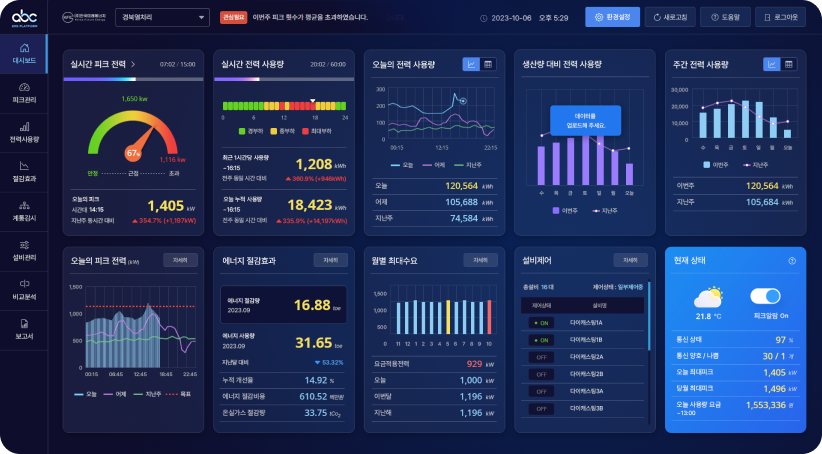

<details><summary>OCR 텍스트</summary>

```
Cosmet eee! > BRD ows nn 1 mae sama.
실시간 피크 전력 > 009271500 실시간 전력 사용량 2002160000
1,650 ew 1
° ‘ 2 ” 과
Bort Sart w rave
116 kw DR NAR
in 705 1,208 wn
5205 BERMAN =a 580.9% (+oseKnn)
Saas certs
시지 에다 1,405 w ves
AGE RAT Cha] @ 354.7% (+1, 107K) 전주동떨시간대이0 23:
오늘의 피크 전력 aw 지배 에너지 질김효과 Sal
1900
eee
ase 16.88...
ry
20000 31.65...
shee ‘78326
0016 onde Meta | 2260
AR 14.92 =
a eo 에너지 BU 610.52 wew
온실가스 절관영 33.75 wo,

오6의전력사장 =

오노 120,564 새
04 105,688 ann
nee 74,584 ann

월별 최대수요 지배

yoo
1900
wo

eo nz123456780%

요근적본편력 929 ww
ae 1,000 ew
이러 1,196 ew
mt 1,196 iw

생산량 대비 전력 사용량

+ ㅋ 8

Booms

© 새로고칠 Osa B 로그아웃
주간 전력 사용량 | 더
35000
22000
“il
|
8 ade ㅎ 9 &
Bore + mF
이번주 120,564 에
9) 개
지난주 105,684 xn

지드

7

Pa: WOH
an

CEASA

ASB

HUA B A

.다셔변스안28

.다셔젼스타리

다이케스틴30:
```

</details>

---

## #slide2-1 — 대시보드

**항목:** 대시보드 위젯

대시보드 위젯

### 이미지: `2_02.png`

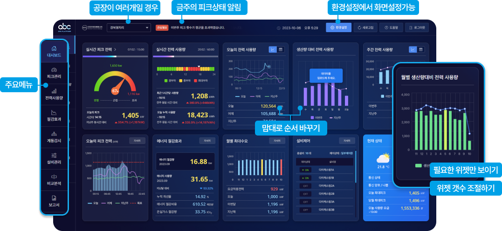

<details><summary>OCR 텍스트</summary>

```
0

> BRD owe nn 1 mae zaemtaua. 2023-10-08 29 5:29 © 새로고위 © sav B 22012

실시간피크전력 > ors MARIA? mom = 오늘의전력사용량. BP au cul acl ge 주간전력사용량 @-
am
1,650 eww ptt Lt
190000000000 8 00006 =m
© 6 ㅎㅎ |
Bors weve wave IN NR 월별 생산량대비 전력 사용량
'
“75 2s 226
아이 1,208 vs 22 on 이
건주 동일 시간대니 디시

오는 120,564
Saas Serer
시저 34.98 1,405 w ves 18,423 vn 때 =
RUEBNDAM =. 354.7% (011974) SA BWARIC 4595.95 (494,197) ee
오늘의 피크 BB ow 지배 에너지 절김효과 기 월멸 최대수요 7" 설비제어 지배
1960 out od PATE: WOH
0 Bae said
aS 16.88... 56, wud were
a4 ㆍ‥메 .다셔견스튀16
ee
paces 31.65... Oo umdaDanov00D 이에 a
shee 90 78326 요근적용편력 929 w
0016 0066 다64 | 1%46 | 2246 ae 1492 « on 1,000 ww oF mA eB
oe om mee oo a un we 610.52 mew rent 1,196 ew cone
은실가스 절관왕 33.75 10 mete 1,196 aw : Gand
```

</details>

---

## #slide2-2 — 대시보드

### 이미지: `2_3.png`

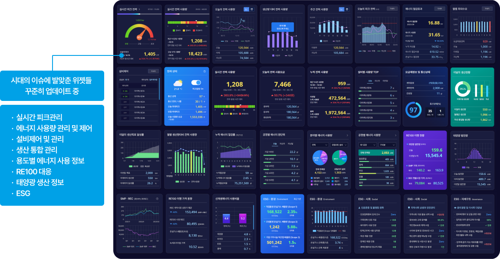

<details><summary>OCR 텍스트</summary>

```
설시간피크전력 >

xo

ㅡ빠져 — ems — me

실시간 편력 Ate?

on Pome fn

neo

“ws 1,208
BS 18,423 nn

bli

wen + re

05100 OFS 가져 동장:

ec mae as at
153,494 어여

RECON REC
an

80.495 maven

PwoMEBRD
8.130 se

TR

10.52 ~

oe 120,564 내
1] 105,688 wm
was TA S8A on

.실시간 전력 Hee

1,208

2 AI (+9
때 떼시기

ete Wh)
겨

=)

4as
235
1s*
07

ESE 대비 전리 ALE

ave
we

7,466

smoot 39/8
250.7% (+3468)
깨깨세여
3120.94
18,564 6
180,564 4

FU wee | 0

“hs

Gn <2
ree 120,564 we
cad 105,686 we
누적 전력 HER
ad 959 nn
CORMAN As OKG LET

Tee 472,564.

com

Shae 1,972,564 on
ue

a 5499

Ore ORLA AED >

때 뼈 ~

oper aan me
153 1,503 40
Bae | 거기 Be 19

ㅇ에메배 지이 ed
om ee | 파

690 -고권 다브개어

We pe OE 자

EWISMRY 168,522 corre
ewIsuAR 374
ews ne aE ~

LAH PA we 때 MI BRIA ae
= =" 16.88.
enue
ba 개 31.65_
"| 지며 vam
vena 14925
그 11 그 베이지 1610.52
으외자 33.75 cm
seis AER TOP Rap Ee
mee new
= 08 ern aste
extant 7 al 2,020 we
en Me
estes
97) = 1
내 uns

=
— oe + FC MBNB TFA ce

= [고 x 79,084 9 80,525
(E50 사위 에여 690 «AE coca

a teeeaEee ee © Ream er tee
IVI WSS 200 oe a |
Ree Oe <n Bees 20 Ree 에트
aeRO on Be 1 -52
eevee 한새 대 AOMENG OewED | Zero
8 8 =~ 94101 ete oe vee
pe ee ™ Ree WHEE Levo
TERA URNA * ve 2떼때: =

we 지대수르

waneum
oe

cnet
지배

a= 제
seeue 159.6 we
caer 489.7 me
ree wee 1SS45 oe

690 -지래구조 여여

© Ba TONE Cet

oven SOB OD ee
PES BARE
tonseee

HR CON BES, NOH
vem en

OU ER Ore 재고
가져 늬1 션

Zero
oN
vor

om

om
```

</details>

---

## #slide2-3 — 대시보드

**항목:** 대시보드 전력메인

대시보드 전력메인
 전력 사용량 및 피크 관리, 
 설비 제어 상태를 
 한눈에 파악하기
 전력 사용과 관련된 주요 지표들만 요약
하여 한 눈에 모니터링 하실 수 있도록 전력용 메인 대시보드 페이지를 별도로 분리하였습니다. 
 실시간 피크 관리, 실시간 전력 사용 모니터링, 오늘 하루 피크와 전력 사용량을 그래프로 확인 가능합니다.
 이달의 최대 피크와 절감율, 주간 전력 사용량 및 주요 설비 제어 상황과 설비별 사용 비율도 확인 하실 수 있습니다.

### 이미지: `2_04.png`

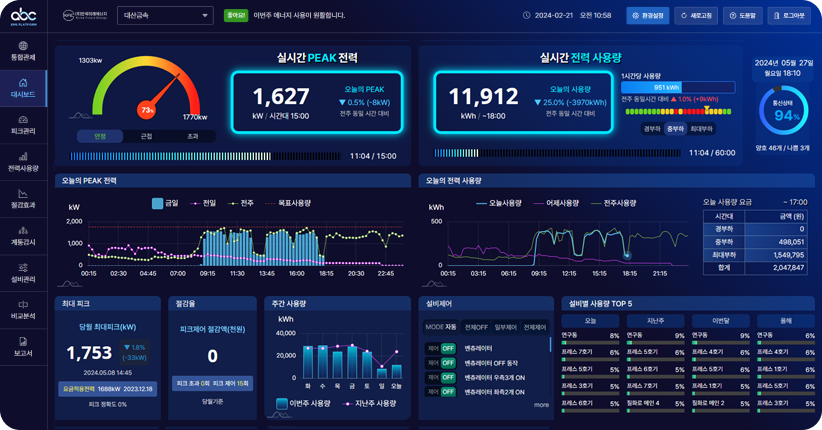

<details><summary>OCR 텍스트</summary>

```
비구분석

Goreme | 다산2소

완를

ay aa

ㆍ BRD oss tty 80) eee,

MAIZEPEAK HY

1,627

KW 시간대 15:00

11111

오늘의 PEAK 전리:

최대피크

당월 최대피크(<):

1,753 ©

2024.05.08 14:45

피그 BREOK

1

피크제어 절감액(천원)
0
[sao wet)

we

202% PEAK 오\의 NBR
on (80 1 1 ,91 2 ir (-3970KWh)

전주 ew 시간대비 kWh | ~18:00

11:04 / 15:00 111

실시간전력 사용량

pers ㅡ 오#사8장 . -- 제사장. --전주사8랑

N30 13451600185 2030 | 2246 0055 0316 00716 005 2716 | 레더

1S 25

주간 사용량: 설비제어 Mie ANS TOPS
wn UMOFF AEH 전걱제어 at
40,000 ： ae 678 8% 876
버 =
0 주 ㆍ sect BMA7O = 6% «HALAS
. oa ㆍ 벅
A ! ‘eal a Ct 그세스 5071 55 -모세스 6오기
° {SAH PAZ ON ㆍ .
BMS 3오기 브레스 7오기
와 < 8 2 도 일 오르 —— 2 xs
Mowsase ~ 지난주 사용량 = 329스097 SK

LX

5%
5%

5%

오늘 사용량 RR

oe
mats 4271
BAA 5971
ㆍ

mas 1271

mmc ore 2
ㆍ

2

5%

© 2028-0221 오리050 (ww) cams) | Osen a aoe

~ 1700

a8

프게스 4091
ㆍ

ms 1071
ㆍ

프게스 5271
ㆍ

BMA 3071
ㆍ

을 을 을 요
```

</details>

---

## #slide2-4 — 대시보드

**항목:** 대시보드 전력메인

대시보드 전력메인

### 이미지: `2_05.png`

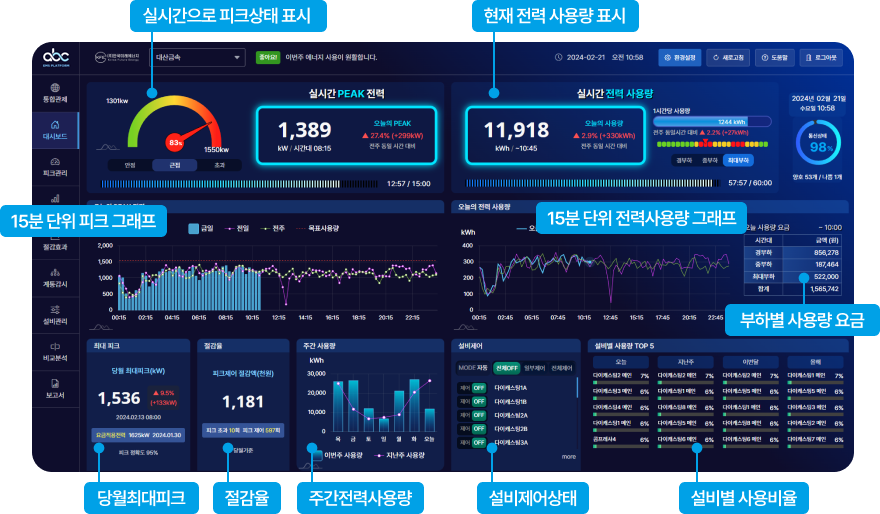

<details><summary>OCR 텍스트</summary>

```
@rem: | 4024 BD ers ry 801 eee © 202-022 ouross (www) cass) | Osen a csoe
@
동이 실시간 『ㄷ(전력 실시간전력 사용량 20048 cow 218
URE ACR a 10:58
a 으\여1646 ele 매매
대시보드 1 ,389 A 274% (+299KW) 22.9% (+330KWh) fh BE MUNDO A 22% (77K) it
kw / ARgig 0848, 전주 Sec kwh 편주 SUAOM 대 0000 00000 98>,
@ oo au = ave ave (iva)
maze
“0 5폐/48데
00000) 125771500 57:57 160:00
al
.16분단위피크그래프 2900 전계 us 옥표48강 . , 16분단위전력사용량그래프 . -1000
= atid
2,909
weet
; 비그 eae ae oy taal
ABA ad \
soo 0 na
= ° . 0
nee 0016. 005 0416 ORIG 00165 HIS HTSUS NBS HG 22S 009 . 0246 SIG 0046 때 7046 TMS | 2016. 22406
cp 최대피크 wae 주간 사8광: 설비세어 ‘Mera ABE TOPS:
aes kon Ey ae ore ae
MODE XE torr ay wh
5 Be Nama RW) 퍼크제어 절감엑(천원) 30000 r Comoe 7% COMSUZNE 7% CHMOWZME | 75 ChINONINE 7%
f = = = =
보고서 aasK 20000 ER sansa comcuser 6% cow ex cesta ex | 다이역스위으케인 6x
1.536 = 1,181 때 gone I = = =
ㆍ '대09스딘4메긴 ex 다이케스딘르에인 ex CKIROUIA ex - 다위케스된그려전| 6%
20040233 08:00 a " al oe (GR comnsnizn . . PY «
| tae cette
, 11100! 자 comesnett on ctovtensmet ex 자지 전 ox 자스: ox
| REMUEES warmW 70760130 a 08 8 인 인 8 ob os ene oe 다여케스96 에덴 6x 다어케스86 해전 6x ChINANTZOR 66x

a ㆍ .
Pt — ＊ 지년주시유황 more
```

</details>

---

## #slide3 — 피크관리

**항목:** 피크상태 / 피크상태 - 설비제어

피크상태
 15분 단위로 목표치와 실제 전력 사용량을 한 눈에 비교할 수 있는 그래프와 데이터를 제공하여 
 PEAK 관리와 제어 파악
을 쉽게 하실 수 있습니다. 또한 월 단위 최대 수요 그래프와 절감 정보를 제공하며, PEAK 초과시 소리로도 알람을 제공합니다.
 피크상태 - 설비제어
 실시간으로 등록된 설비 제어 상태를 확인하고 온/오프 상태를 제어할 수 있습니다.

### 이미지: `6_1.png`

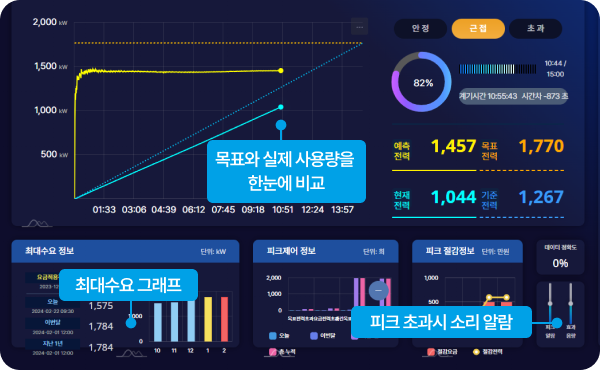

<details><summary>OCR 텍스트</summary>

```
1500 iw

47
000 1600

1,000 sw

전력

96 1,.457 SE 1,770

현재

01:33 03106 04:39 06:12 07:45 0908 10:51 12:24 13:57 전력

o n 2
```

</details>

### 이미지: `6_2.png`

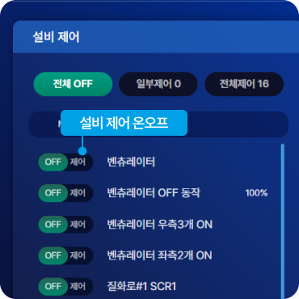

<details><summary>OCR 텍스트</summary>

```
설비 제어

- 레야 일부제어 0 전체제어 16

벤츄레이터

벤츄레이터 OFF 동작 100%
벤츄레이터 우측3개 ON

벤츄레이터 좌측2개 ON

질화로#1 SCR1
```

</details>

---

## #slide3-1 — 피크관리

**항목:** 부하상황판 / DC 제어설정 / DC 그래프

부하상황판
 등록된 설비의 입출력 전압과 입출력 전류, 온도설정등에 대한 부하 상황을 확인하고 필요에 따라 온/오프 스위치로 부하상태를 제어할 수 있습니다. 
 DC 제어설정
 최대 사용전력이 목표전력을 넘지 않도록 부하상태를 자동으로 감시 및 관리합니다. 
 목표전력
 : 예측전력이 목표전력을 초과하면 피크제어를 실행함
 PCT 비율
 : PT와 CT가 같이 내장되어 있는 MOF의 배율임. PT 배율이 13200 : 110이고 CT 배율이 20 : 5라면 PCT 비는 13200/110 * 20/5 = 480이 된다. (계량기에 표시됨)
 펄스정수
 : 전력량계가 일정 전력량 측정 시마다 외부로 출력하는 펄스 신호이며 일반적으로 5000Pulse라 함은 전력량계가 1kWh를 측정하는 동안 외부로 5000Pulse를 출력한다는 것을 의미함. (계량기에 표시됨)
 운전모드
 : 수동일때는 피크제어를 하지 않음
 제어 On Delay
 : 피크제어때 제어를 요청하기 위해 기다리는 시간(초)
 제어 Off Delay
 : 제어중지를 요청하기 위해 기다리는 시간(초)
 안전 퍼센트
 : 10% 값으로 설정되어 있다면 목표전력 초과 10%전에 피크제어를 하게됨
 초기 제어금지
 : 한전계측(15분단위)이 시작하고 몇초가 지난 후 부터 피크제어를 시작할지 설정함
 제어방식
 : 우선순위제어는 제어설비에 부여된 우선순위 번호를 기준으로 오름차순으로 제어를 하고 순차제어는 제어설비의 등록번호 기준으로 오름차순 순서로 제어를 함
 DC 그래프
 원하는 날짜에 15분 단위로 전력사용량의 목표대비 실측 그래프와 정보를 확인할 수 있습니다.

### 이미지: `6_3.png`

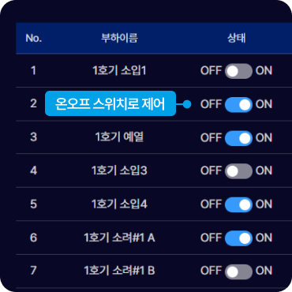

<details><summary>OCR 텍스트</summary>

```
1 1호기 소입1

: 은오뜨스위치로지어
3 1호기 예열

4 1호기 소입3

5 1호기 소입4

6 1호기 소려#1ㅅ

7 1호기 소려#16

OFF @ ON
OFF @@® On
OFF @@® On
OFF @ ON
OFF @@ On
OFF @@® ON
OFF @ ON
```

</details>

### 이미지: `6_4.png`

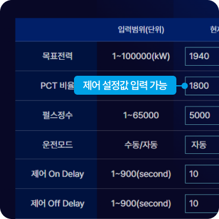

<details><summary>OCR 텍스트</summary>

```
입력범위(단위) 현)

목표전력 1~100000000) | 1940
펄스정수 1~65000 | 5000 _
운전모드 수동자동 | 자동

제어 00 Delay 1~900(second) | 10

제어 Off Delay 1~900(second) | 10
```

</details>

### 이미지: `6_5.png`

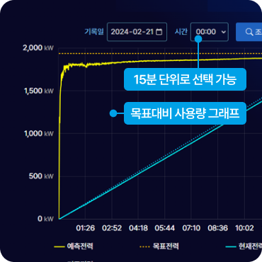

<details><summary>OCR 텍스트</summary>

```
2024-02-21 | 시간

2,000 kw

1,500 kw

1,000 kw

01
01:26 02:52 0478 05:44 07:10 08:36 10:02

ㅡ- 예측전력 ……‥ 목표전력 ㅡ- 현재전
```

</details>

---

## #slide3-2 — 피크관리

**항목:** 전력사용보고서 / 피크 15분 전력보고서 / 피크제어이력

전력사용보고서
 선택한 달의 전력 사용량을 날짜와 시간별로 표 형태로 제공하며, 각 해당일의 최대피크 수치는 붉은 색으로 표기하여 쉽게 확인 가능합니다. 
 피크 15분 전력보고서
 오늘의 15분 단위 피크 상황을 그래프로 확인 가능하며, 아래 표에는 선택한 달의 일일 피크 정보를 날짜와 15분 단위로 확인 할 수 있습니다. 
 피크제어이력
 몇일, 몇시에 피크 제어를 몇 번 했는지에 대한 이력이 바 형태의 그래프로 제공됩니다. 아래 표에는 설비별 피크 제어 이력 정보가 표시됩니다.

### 이미지: `6_6.png`

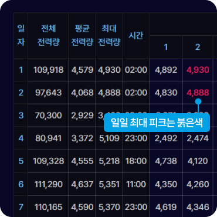

<details><summary>OCR 텍스트</summary>

```
일

70,300
80,941

109,328
111290

110,165

평균 최대

전력량 전력량

psy

시간

4,579 4,930 02:00 4,892
4,068 4,888 02:00 4,830
2,929 3 |

3,372 5,109 23:00 2,492

4,555 5,218 18:00 4,738

4,637 5,351 11:00 4,350

4,590 5,370 23:00 4,619

4,930

4,888

2,474

4,20

4,260

4,346
```

</details>

### 이미지: `6_7.png`

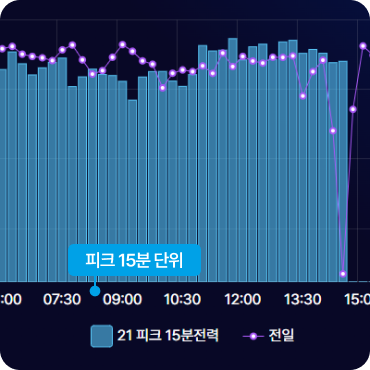

<details><summary>OCR 텍스트</summary>

```
10:30 12:00 13:30 15:

ㄴ^ 21 피크 15분전력 . …* 전일
```

</details>

### 이미지: `6_8.png`

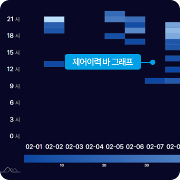

<details><summary>OCR 텍스트</summary>

```
21시

18시

15 시

12시

9시
6시
3시

0시
02-01 02-02 02-03 02-04 02-05 02-06 02-07 02-0
```

</details>

---

## #slide4 — 전력사용량

**항목:** 전력사용량보기

전력사용량보기
 에너지 사용 통합 모니터링
 전체 전력량과 전력 부하별 사용량, 사용요금, 설비별로 특정 기간내 사용한 에너지 사용량 등을 년/월/일/시/15분 단위로 파악이 가능합니다. 
 조회 결과는 파악이 용이하도록 그래프와 요약정보, 시간 단위별 표로 상세하게 제공되며, 오늘과 어제, 전주와 함께 비교가 가능합니다.

### 이미지: `9_1.png`

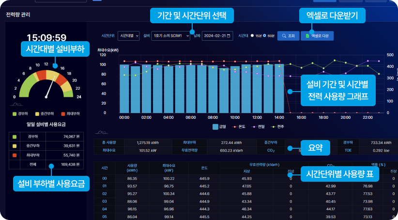

<details><summary>OCR 텍스트</summary>

```
전력량 관리

0 경무하 Bs wy 최대무하

일일 설비별 사용요금

겸무하 74067된

중간무하 39,6318

최대부하 55,740 원
전체 169,428 원

총 사용장
최대수요

1,275.19 kWh

사용량
(kWh)

8635
93.57
95.27

9615

0400 0600 0800 1000

죄대수요
(aw)

100.22

BY «85 © 전일 -« 전주
27244 kWh Suet
650.23 kVarh coz
PRAMS (kVarh)
지상

45.93

4705

45.838

43,34

46.34

44.25

18:00

ㅇㅇㅇ ㅇㅇ

4377
4045
4417
3953

2000

경부하

2200

ㅇ

88 8 8 8

733.34 kWh
0.292 toe

7753
7398
7763
7313

진상

ㅇㅎㅇㅇㅁㅇㅇㅇ
```

</details>

---

## #slide4-1 — 전력사용량

**항목:** 소비량예측

소비량예측
 기업내 에너지 사용 패턴 파악과 
절감 계획을 위한 
전력소비량 예측 비교 제공
 설비별로 에너지 소비 패턴을 파악하고 에너지 절감 계획에 도움을 주기 위해 사용 에너지 소비량을 예측하여 실 사용 그래프와 함께 비교하는 페이지 입니다. 
 생산량 및 매출액, 목표량 대비 효율 등 좀 더 상세한 비교 분석 결과를 위해서는 상단의 엑셀샘플받기 버튼을 통해 정보를 기입후 해당 데이터 파일을 등록해야 합니다.

### 이미지: `10_1.png`

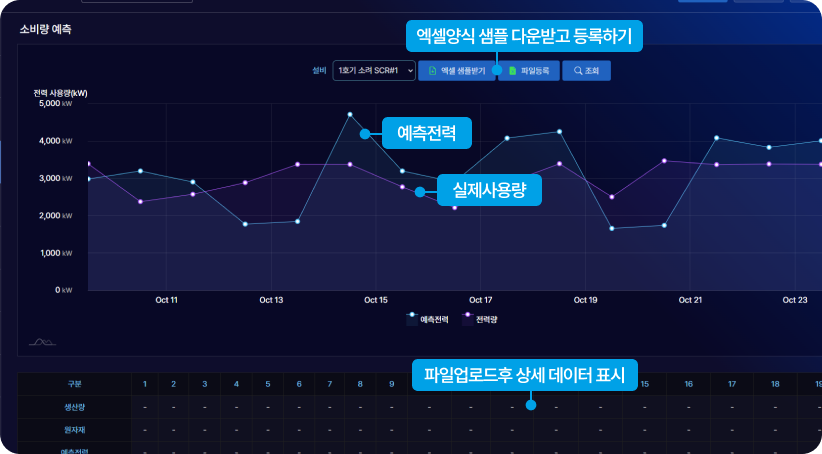

<details><summary>OCR 텍스트</summary>

```
소비량 예측

전력 사용량60\);
5,000 kw

4,000 «w

3,000 «w

2,000 xw

1,000 w

007 0013 Oct 15 Oct 17 Oct 19 Oct 21 Oct 23
```

</details>

---

## #slide5 — 절감효과

**항목:** 절감효과

절감효과
 에너지 절감효과 데이터 제공과 
기업내 에너지 절감 계획을 위한 
목표대비 비교분석 제공
 제어 관리로 인한 에너지 절감량과 누적 개선율, 절감 비용, 온실가스 절감량 등을 그래프와 표 형식으로 제공하고 있습니다. 
 예상 목표와 실제 사용량의 비교를 위해서는 상단의 엑셀 양식 샘플을 다운 받아 기입 후 파일을 등록하면 됩니다.

### 이미지: `11_1.png`

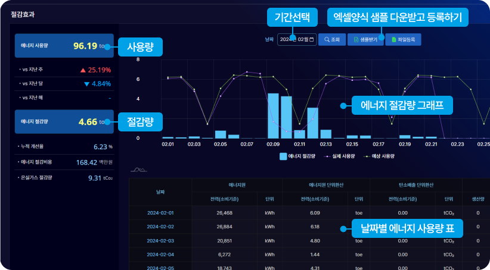

<details><summary>OCR 텍스트</summary>

```
절감효과

vs Ait a
+ vs 지난 St

+ vs 지난해

ㆍ누적 개선을
ㆍ예너지 절감비용

온싫가스 BAB

소 25.1996
Vv 4.84%

0
6.23% 0201 ©0203 0205 020 02m 0213 0215 0217 0219 0221 02.23 0225
een ㆍ 실제사용량 …- 예상 ASE
168.42 %2)2!
LX
9,31 600
에너지원 에너지원 단위환산 탄소배출 단위환산
wat
전력(소비기준) 단위 전력(소비기준} 단위 전력(소비기준) 단위 생산량
2024-02-01 26,468 kwh 609 toe 0.00 1602 o
wees “os “ “ pe OLX] ANSEF "
2024-02-03 20.851 kwh 480 toe 0.00 tCOz o
2024-02-04 6,272 kwh 144 toe 0.00 1602 0
2074-02-05 18 743 kWh 431 toe 000 CO. oO
```

</details>

---

## #slide6 — 계통감시

**항목:** 계통감시

계통감시
 사이트맵 생성으로 
전체 전력 흐름도 
한눈에 조감하기
 기업내 전력 사용의 흐름도를 사이트맵으로 정리하여 에너지 사용량의 변화와 사용량 등 정보를 쉽게 조감할 수 있도록 제작되었습니다. 
 공정 그룹별로 사이트맵을 그룹화하여 새창으로 원하는 그룹만 따로 파악이 가능합니다.

### 이미지: `12_01.png`

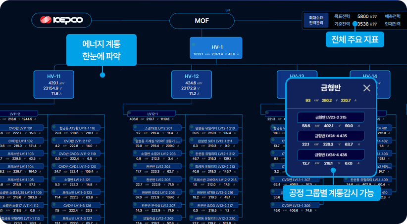

<details><summary>OCR 텍스트</summary>

```
004

00반01301
6 227 ㆍ 1953 ㆍ

CVD LIT 102
36 2190 » 1214 ㆍ

BALE LVI 103
7 2295 ㆍ 425 ㆍ

BMAB LVI 104
B2 ~ 2287 » 1640 ㆍ

BAP LVI 105
Bw 25 ㆍ 579 ㆍ

Bet 소결24,25 LV11-1 109
23 … 2186 ㆍ2036 ㆍ

소결반 소글17 LVI 12
4 ~ 2185 ㆍ 06 4

USS HMAC LITT 113
아가 가

HV-11
429.1 hw
23184.9 v
NBA

1 BSE 405일니티 116

793 … 7186 ㆍ2161 «

1 00802 117

42 ~ 2228 v 140 «

(CVD# CVD3 LV11-2 119

00 에 2224 ~ 65 «

ml CVD CVD4 Lv11-2 120
247 « 2224 y WSA

1 소결반 19713 121

59 om 2222 v UB «

1 BMA LVII-3 123
NA ww 22293 ㆍ 638

1 00080 LVII-3 126
75 « 2224 ㆍ 233

ml BMA WITS 127
‘a9 aw 9220 v 687

MOF }

HV-12
4248 ew
231729 v
124
wit —
23199 WV12 201 완분동 유틸리티 LVI2-1210
12 24 ㆍ 14 4 395 «© 2103 ㆍ 80724 ~
환본동 기계실 120RT BBL. 와븐변901 1612-1211
790 … 2194 ㆍ 2080 « 03 … 21993 » 09 «
소결란소결2119712 203 HB PHIL LVI2-1212
09 에 2123 ㆍ 34 4 467 «© 2993 ㆍ 1301 «
완분반니012 204 BSS RANG LV12-2 213
117 ww 2233 vy 627 ㆍ 408 ww 2193 ㆍ 457 «
Steet Lv12 205, 프레스반 고리셔시 LVI2-2 215.
227 ~ 2229 1 nS ㆍ 10 에 2120 ㆍ 126 «
환분반 91021972 206 SHE ATROLVI2-2 216
600 + 2229 v 1690 « 2 293 ㆍ aaa «
환분반 분석실 612 207 완분반 9903 LV12-2 217
3 에 2229 1 19 « 03 « 7185 v 12 4
wea ivi2412090 ABS PWC! LVI2-2 220

7A oy 99 vy on 4

729 «a9 vy OAD A

목표전역 SBOOKW 예측전력

기준전력

1538 1 현재전력

CvO#t LV13-1 307
```

</details>

---

## #slide6-1 — 계통감시

**항목:** 공정별 에너지 계통

공정별 에너지 계통
 공정별로 분류를 만들어 
에너지 사용량 파악하기
 주요 공정별로 분류를 만들어 
 에너지원 종류 및 에너지 사용량을
 한눈에 파악할 수 있도록 
 제작되었습니다.

### 이미지: `12_02.png`

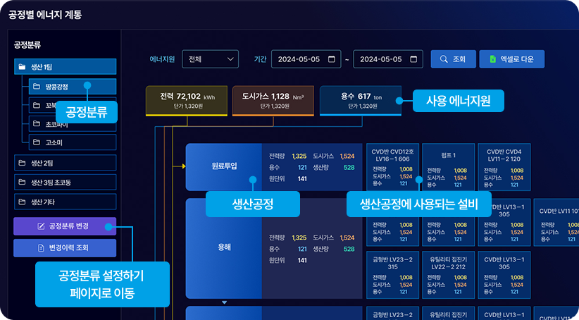

<details><summary>OCR 텍스트</summary>

```
공정별 에너지 계통

& sg

& 생산3팅초코동

연 생산기타

에너지원 | 전체

~ | 기간 | 2024-05-05 ㅁ

72102 ^ 도시가스 1128 nm?
단가1320왼 단가1320원

= aa

용수 677 ton
271132081
040반00012조 000반0004
도시가스 1624 0016-1606 펌프1 tv1-2120
SUB 528 | we 1008 |e 1008. | «wR 1006:
1524 @ SAA 1524 SAVIA 1524
더 용수 겨 용수 21
HLVI3—1
aos CvD¥t LV11 10
1008 RB = 1096: UAB = 1008. TB 1008
1828 || SAPIA 1824 도시가스. 1524 도시가스 182%
도시가스 1524 a or) a ma a m a m
금청반0/23-2 | 유틸리티집진기 || 640반0013-1
315 122-2212 305
ww «1008, 1008-1008
SAVIA 1524 | SAVIA 1524 | SADIA 1524

용수 wm 용수 m 용수 m

BU Lv23-2 유틸리티 집진기 Cure | 라식 이
```

</details>

---

## #slide6-2 — 계통감시

**항목:** 공정별 에너지 계통 설정

공정별 에너지 계통 설정
 공정별 에너지 계통 
설정하는법
 공정분류 추가 및 수정 삭제, 
 작업 공정명 추가 및 수정 삭제, 
 에너지원 설정 및 선택, 
 생산 공정에 사용되는 설비 선택 및 제거가 
 가능합니다.

### 이미지: `12_03.png`

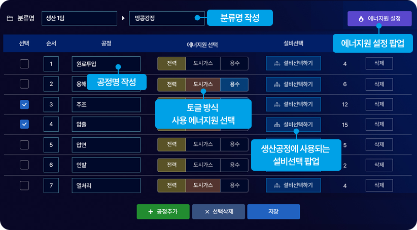

<details><summary>OCR 텍스트</summary>

```
eee [aa oa «(aay

선택 순서 공정 에너지원 선택 설비선택

O fa 원료투입 | Be 용수 . 속, 설비선택하기 4 삭제
[ 2 | io 전력 | ee 설비선택하기 | 6 삭제
@ ㅣ: Mute! | 12 삭제
BS a a 설비선택하기 삭제
O 5 [= | 도시가스 ㅣ 용수 | 삭제
O |e 인발 | BSE 삭제
O |? 열처리 EAA ㅣ 용수 fe 설비선택하기 | 4 삭제
```

</details>

---

## #slide7 — 설비관리

**항목:** 주요설비 설정

주요설비 설정
 각 설비들에 대한 정보와 사용량,
 제어 상태를 한 눈에 파악하기
 CID
 : 주요설비 고유번호 
 설비명
 : 관리를 위한 설비명 
 전압/전류
 : 전력계측 정보 설정시 실시간 정보 표시됨
 온도
 : 온도계측 정보 설정시 정보가 실시간으로 표시됨
 현재값
 : 릴레이 전류(4~20mA)값 입니다.
 최적화제어
 : 최적화제어 설정 적용된 경우 표시
 제어시간
 : 최적화제어 적용후 제어된 누적 시간
 절감금액
 : 최적화제어 적용후 절감된 누적 절감금액

### 이미지: `13_01.png`

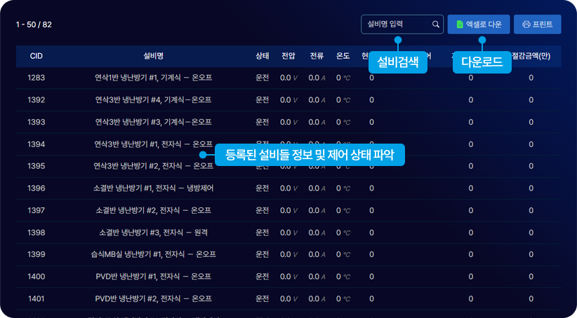

<details><summary>OCR 텍스트</summary>

```
1-50/82

cID

1283

1392

1393

1394

1395

1396

1397

1398

1399

1400

1401

설비명 상태
연삭1반 냉난방기 #1, 기계식 - 온오프 운전

연삭3반 냉난방기 #4, 기계식-온오프

6

연삭3반 냉난방기 #3, 기계식-온오프

rf
ra

전압
0.0 v
0.0v

0.0v

전류
0.04
0.04

0.04

연삭3반 냉난방기 #2, 전자식 - 온오프 oo :

소결반 냉난방기 #1, 전자식 — 냉방제어 운전
소결반 냉난방기 #2, 전자식 - 온오프 운전
소결반 냉난방기 #3, 전자식 - 원격 운전
CAMBS 냉난방기 #1, 전자식 - 온오프 운전
6\/0반 냉난방기 #1, 전자식 - 온오프 운전

PVDYt 냉난방기 #2, 전자식 - 온오프

더
ra

0.0 v

0.0v

0.0 v

0.0 v

0.0 v

0.04

0.04

0.04

0.04

0.04

0.04

=

=

ㅇ=

ㅇ=

[=

=
```

</details>

---

## #slide7-1 — 설비관리

**항목:** 주요설비이용률 / 주요설비부하율 / 설비제어

주요설비이용률
 사용량이 높은 주요 설비 10개에 대한 이용율을 하나의 그래프 안에서 비교하실 수 있습니다.
 기간
 : 기간설정을 통해 하루평균 이용률을 적용 가능
 이용률
 : 하루 24시간을 100% 사용률로 환산되어 이용률이 설비명과 함께 표시됨
 주요설비부하율
 사용량이 높은 주요 설비 10개에 대한 부하율을 하나의 그래프 안에서 비교하실 수 있습니다.
 기간
 : 기간설정을 통해 평균 부하율 적용
 부하율
 : 전체 전력사용량 대비 주요설비가 차지하는 사용량을 100% 사용률로 환산되어 설비명과 함께 표시
 설비제어
 등록된 설비에 대한 제어 상태 및 출력 상황, 제어 시간, 제어로 인한 절감 금액을 그리드 형식으로 파악하실 수 있습니다.
 운전
 : 현재 가동 중일때 활성화
 제어
 : 피크제어 중일때 활성화
 최적화
 : 최적화 제어 적용되어 제어 중일때 활성화
 출력
 : 출력전류 기준(4~20mA)값을 100% 환산하여 현재 출력상태 표시.
 제어시간
 : 최적화제어가 적용되어 제어된 누적 시간
 절감금액
 : 최적화제어가 적용되어 절감된 누적 절감금액
 온도와 출력 전류값을 실시간으로 기록한 데이터를 시각화하여 볼 수 있습니다.
 설비제어 기본 정보를 수정할 수 있는 팝업 창을 띄웁니다.

### 이미지: `13_2.png`

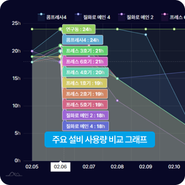

<details><summary>OCR 텍스트</summary>

```
* 콤프레사4 。 질화로메인4 ” 질화로메인2 “ 프레스(
```

</details>

### 이미지: `13_3.png`

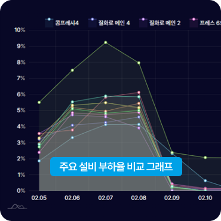

<details><summary>OCR 텍스트</summary>

```
콤프레사4 。 질화로메인 4

” 질화로메인 2

* 프레스 6:

0205 02.06 02.07

02.08 02.09
```

</details>

### 이미지: `13_4.png`

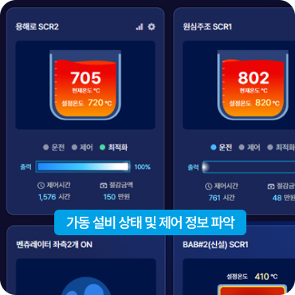

<details><summary>OCR 텍스트</summary>

```
용해로 5002 al & 원심주조 5001

때
@ 운전 @ 제어 © 최적화 @ 운전 © 제어 © 최적화
~: TD 200% 개
© 제어시간 02 절강금액 © 제어시간 #2
1576 시간 150 만원 761 시간 48 만원
벤츄레이터 좌측2개 ON 648#2(신설) SCRI
온도 410°C
```

</details>

---

## #slide7-1-1 — 설비관리

**항목:** 설비제어 - / 설비제어 - / 최적화제어

설비제어 - 설정 팝업
 그룹이름
 : 그룹 이름이 같은 설비는 쌍으로 상하로 표시됨
 설비이름
 : 관리되는 설비이름
 우선순위
 : 피크 우선순위 자동제어 할 때 오름차순 순서로 제어함
 기본설정온도
 : 그래프에서 기준이 되는 온도 정보로, 제어에 영향을 미치지 않음
 피크제어수치
 : 읽기전용, 제어 중일때 사용 되는 출력 설정값 (0 ~ 100%)
 게이트웨이
 : 읽기전용, 통신하기 위한 게이트 고유번호
 노드번호
 : 읽기전용, 게이트 연결 번호(1~10)
 채널번호
 : 읽기전용, 연결된 채널 정보
 설비제어 - 그래프 팝업
 날짜 및 시간
 : 1시간단위 이전 시간의 기록 확인 가능
 시간별 설비온도
 : 최적화 제어에서 설정된 온도 조건과 해당시간의 온도가 표시됨
 시간별 제어전류
 : 해당시간의 제어시 입력 전류와 출력 전류가 표시됨
 최적화제어
 활성
 : 스위치로 활성/비활성 동작
 제어기간
 : 설정된 제어 기간에만 최적화제어가 작동됨
 계절제어
 : 제어기간 동안 해당 계절에만 최적화제어가 작동됨
 요일제어
 : 설정된 요일동안 최적화제어가 작동됨
 시간제어
 : 설정된 시간에만 최적화제어가 작동됨
 분단위제어
 : 설정된 분마다 최적화 제어가 시작되고 설정된 분동안 작동됨
 온도조건
 : 설정한 온도조건에 따른 출력정보 목록 표시
 적용설비
 : 최적화제어가 설정된 설비목록 모두 표시

### 이미지: `13_4_1.png`


<details><summary>OCR 텍스트</summary>

```
~ \

x |

개별 설비설정
그룹이름 COPIA 00
설비이름 다이캐스팅14.
우선순위 1
기본설정온도(6) 660
피크제어수치(%) 40
게이트웨이 a7
노드번호 1
```

</details>

### 이미지: `13_4_2.png`

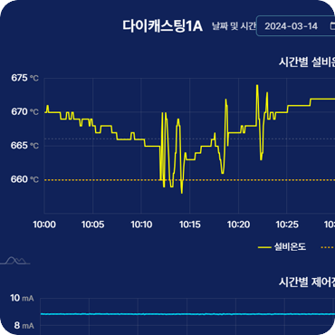

<details><summary>OCR 텍스트</summary>

```
세
다이캐스팅14& 날짜및시간 2024-03-14 【

시간별 설비:

10:00 10:05 10:10 10:15 10:20 10:25 10:
— 설비온도

시간별 제어

10 ma

LB mA 4
```

</details>

### 이미지: `13_5.png`

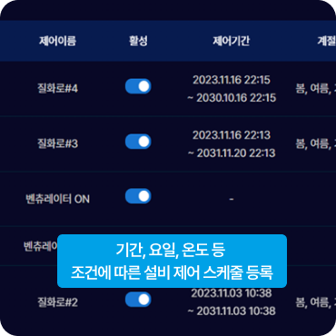

<details><summary>OCR 텍스트</summary>

```
제어이름 활성 제어기간 계절

_@ 2023.11.16 22:15

as ~ 2030.10.16 22:15 를 여름
_@ 20231116 22:13

a ~ 2031.11.20 2273 -

벤츄례이터 ON _@ -

벤츄레

2023.11.03 10:38
질화로#2

~ 2031.11.03 10:38 를, 이통.
```

</details>

---

## #slide7-2 — 설비관리

**항목:** 최적화제어 - 스케줄등록 팝업창

최적화제어 - 스케줄등록 팝업창
 제어이름
 : 최적화제어 관리를 위한 이름
 제어시작/종료
 : 최적화제어를 사용하는 기간. 빈값일때는 항상 최적화 제어 가능 상태임
 제어복제
 : 기존에 등록된 최적화제어 설정값을 현재 설정값으로 복사함
 계절선택
 : 해당 계절에만 최적화제어를 적용할 때 선택
 요일선택
 : 해당 요일에만 최적화제어를 적용할 때 선택
 시간제어
 : 하루 24시간에서 시간기간을 설정하여 최적화제어 가능
 : 시간제어 항목을 추가
 : 시간제어 설정정보를 빈값으로 적용 (시간 설정 항목을 삭제하기 위해 사용)
 분단위제어
 : 60분마다 30분 제어 설정한다면 60분 대기 후 30분 제어를 반복하게됨
 온도조건
 : 최적화 제어시 설정된 온도범위는 출력설정 퍼센트 만큼 출력이 조정됨
 : 온도조건 항목을 추가
 : 온도조건 정보를 빈값으로 적용 (온도조건 항목을 삭제하기 위해 사용)
 적용설비선택
 : 전체설비 중 최적화제어를 적용하기 위한 설비를 선택하면 활성화됨

### 이미지: `13_5_2.png`

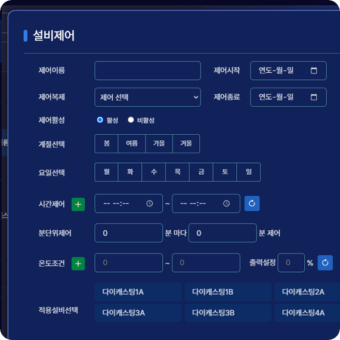

<details><summary>OCR 텍스트</summary>

```
| 설비제어

제어이름
제어복제
제어활성

계절선택

요일선택

시간제어 [+
분단위제어

온도조건

적용설비선택

wwe (ene 0

재배 -| 재테
@ 활성 @ 비활성

봄 | 여름 | 가을 | 겨울 |
alalelsijals| a]

= 911-~- 900

0 jor) 0 |분제어

0 )-[ 0 | aawa/o |x [의
다이캐스팅14. 다이캐스팅18 다이캐스팅24.
다이캐스팅34 다이캐스팅38 다이캐스팅44

_/
```

</details>

---

## #slide7-2-1 — 설비관리

**항목:** 최적화제어이력 / 냉난방제어 / 냉난방 제어설정 팝업창

최적화제어이력
 최적화제어에서 등록된 설비제어 스케줄의 이력 정보가 저장됩니다.
 제어설비
 : 제어설비별로 이력 확인 가능
 제어방법
 : 적용된 최적화제어 이름
 제어시작/종료
 : 최적화제어가 진행된 시간
 제어시점 온도
 : 최적화제어가 시작될때 설비의 현재 온도값
 종료시점 온도
 : 최적화제어가 종료될때 설비의 현재 온도값
 제어시점 출력
 : 최적화제어가 시작될때 설비의 출력 4~20mA 정보
 종료시점 출력
 : 최적화제어가 종료될때 설비의 출력 4~20mA 정보
 제어설정
 : 최적화제어에 적용된 출력설정 값
 제어시간
 : 현재 출력값으로 최적화제어가 진행된 시간
 절감전력
 : 최적화제어를 통해 절감된 전력량
 냉난방제어
 환경설정의 시퀸스 제어를 통해 등록된 도면과 설비 위치, 제어 정보를 확인하고 제어 방식을 선택할 수 있습니다.
 냉방/난방
 : 냉방/난방과 도면 위치별로 해당 냉난방 설비목록 확인 가능
 도면정보
 : 도면위에 설비위치 정보와 설비 정보를 확인
 설비이름
 : 현재 선택된 설비 이름
 현재상태
 : 설비운전 ON / 설비중지 OFF 상태
 전압/전류
 : 시퀀스제어 설정에서 전력계측이 선택되었을 경우 실시간으로 전압/전류 정보가 표시
 제어모드
 : 제어모드가 자동일 경우 피크제어시 자동으로 제어를 진행
 순위
 : 피크 우선순위 자동제어 할 때 오름차순 순서로 제어함
 냉난방 제어설정 팝업창
 수동제어 설정
 : 수동으로 ON/OFF 제어요청 가능
 제어보드 설정
 : 수동/자동으로 제어모드를 변경 가능
 우선순위
 : 피크 우선순위 자동제어 할 때 오름차순으로 제어함

### 이미지: `13_6.png`

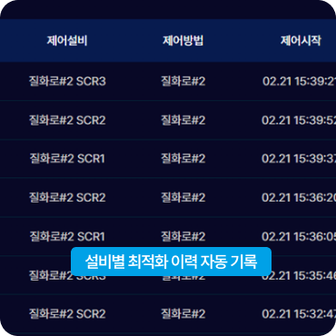

<details><summary>OCR 텍스트</summary>

```
제어설비

질화로#42 SCR3

질화로#2 SCR2

질화로#2 SCR1

질화로#2 SCR2

질화로#2 501

제어방법

질화로#2

질화로#2

질화로#2

질화로#2

질화로#2

제어시작

02.21 15:39:2

02.21 15:39:5:

02.21 15:39:3;

02.21 15:36:2(

02.21 15:36:05

질화로#2 SCR2

질화로#2

02.2115:32:4;
```

</details>

### 이미지: `13_7.png`

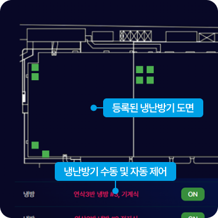

### 이미지: `13_7_1.png`

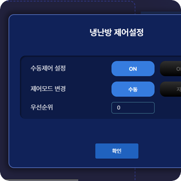

<details><summary>OCR 텍스트</summary>

```
냉난방 제어설정
```

</details>

---

## #slide8 — 비교분석

**항목:** 목표대비 비교분석

목표대비 비교분석
 설비별 에너지 사용량 비교는 물론 
생산량 및 매출액 대비 효율을 
가늠해보는 비교분석 페이지
 비교 분석할 설비를 선택후, 원하는 시간 단위와 기간을 선택한 뒤, 분석하고자 하는 내용을 선택해 줍니다. 
 생산량 및 매출액, 목표량 대비 효율 등 좀 더 상세한 비교 분석 결과를 위해서는 오른쪽 상단에 있는 초록색의 파일 업로드 버튼을 통해 해당 데이터 파일을 등록해야 합니다.

### 이미지: `16_1.png`

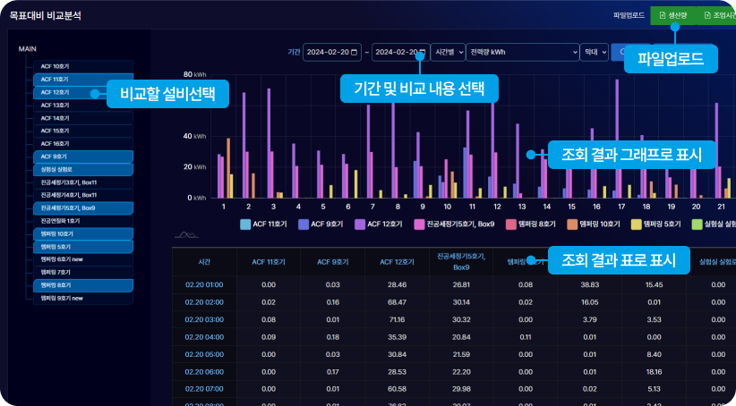

<details><summary>OCR 텍스트</summary>

```
목표대비 비교분석

712! | 2024-02-20 | - | 2024-02-29 | 시간별 v| zister KW 이 역대 ~

1504

409

20190 | |
2 3 4 5
a

14 15 16 17

14

싸 1192 @jacros7 jacri2e71 GP 202서징기5호기, 6000 민퍼킹 6호기. 면퍼2 70호기 | 0 민끼킹 5흐기 Phase

기5호기
시간 ACF 1171 ACF 9로기 ACF 12821 seen is BS] eae BAY 실허실 atts

1

20 21

02.20 01:00 0.00 0.03 28.46 2681 0.08 3883 18.45 0.00
02.20 02:00 0.02 016 6847 3014 0.02 16.05 001 000
02.2003:00 0.08 001 7116 30.32 000 3.79 3.53 000
02.20 04:00 0.09 018 35.39 2084 on 001 0.00 000
02.20 05:00 0.00 0.03 30.84 21.59 0.00 001 8.40 000
02.20 06:00 0,00 017 28.53 22.20 0.00 001 1816 000
02.20 0700 0,00 001 6058 29.98 0.00 0.02 513 000
```

</details>

---

## #slide8-1 — 비교분석

**항목:** 1. 비교할 설비선택 / 2. 기간 및 시간 단위 선택 / 3. 비교할 항목 선택

1. 비교할 설비선택
 비교 분석을 하고자 하는 설비는 토글 방식으로 원하는 갯수만큼 선택합니다. 선택 할 수 있는 최대 개수는 12개 입니다.
 2. 기간 및 시간 단위 선택
 비교 분석을 위한 기간을 날짜 형식으로 선택하고, 시간별, 일별, 월별, 연별중 원하는 시간 간격을 선택합니다.
 3. 비교할 항목 선택
 분석할 항목을 선택합니다. 생산량, 조업시간, 매출액, 목표량 대비의 비교 결과를 위해서는 해당 데이터 파일을 엑셀로 먼저 등록해야 합니다.
 온실가스배출량
 : 사용한 전력량을 온실가스로 환산하여 비교 데이터를 제공
 생산량대비(설비효율)
 : 생산량대비 전력사용량 비교 데이터를 제공
 조업시간대비(시간당설비효율)
 : 조업시간대비 전력사용량 비교 데이터를 제공
 매출액대비(원단위설비효율)
 : 매출액대비 전력사용량 비교 데이터를 제공
 목표량대비(전력소비효율)
 : 목표량대비 전력사용량 비교 데이터를 제공

### 이미지: `16_2.png`

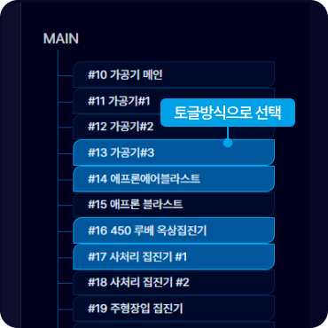

<details><summary>OCR 텍스트</summary>

```
#10 가공기 메인
#11 가공기#1
#12 가공기#2

#15 애프론 블라스트

#18 사처리 집진기 #2
#9 FSSA 집진기
```

</details>

### 이미지: `16_3.png`

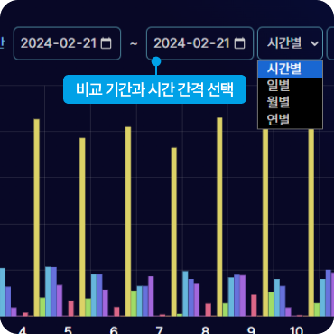

<details><summary>OCR 텍스트</summary>

```
t | 2024-02-218 | ~ | 2024-02-21 도 ㅣ 시간별 |

일별
월별

[ I
A | 개 a ~ ， Q a 10
```

</details>

### 이미지: `16_4.png`

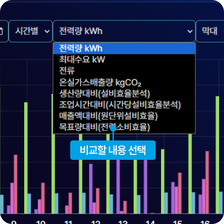

<details><summary>OCR 텍스트</summary>

```
최대수요 kW
전류

온실가스배출량 06@2

생산량대비(설비효율분석)

조업시간대비(시간당설비효율분석)
매출액대비(원단위설비효율)

목표량대비(전렬소비효율)
```

</details>

---

## #slide8-2 — 비교분석

**항목:** 4. 파일업로드하기 / 5. 파일업로드 - 팝업창 / 개별센서관리

4. 파일업로드하기
 생산량, 조업시간, 매출액, 목표량 대비의 비교 결과를 위해서 상단 오른쪽의 초록색 버튼을 클릭하여 파일을 업로드 합니다. 원하는 항목을 클릭하면 업로드를 위한 팝업창이 뜹니다.
 5. 파일업로드 - 팝업창
 팝업창에서 초록색 버튼의 숫자 순서대로 진행합니다.
 기간
 : 해당하는 월간 데이터 확인 가능
 엑셀다운
 : 해당하는 월의 전체 설비의 정보입력 양식파일을 엑셀형식의 파일로 다운받음
 파일등록
 : 양식파일에 데이터 입력 후 서버에 저장하기 위해 파일을 등록함. 파일을 등록하면 현재 화면에 입력한 데이터가 출력되며 서버에 저장된 상태는 아님
 파일저장
 : 파일등록 후 파일저장을 해야 서버에 파일을 저장하게 됨
 참고
 : 자동 데이터 입력은 MES / ERP 데이터 베이스 연동을 통해 주기적으로 데이터 입력이 가능합니다.
 개별센서관리
 설비별로 부여된 센서를 통해 디바이스 정보와 전압, 전류, 역률, 누적 전력량 등 주요 데이터를 확인 할 수 있습니다.

### 이미지: `16_5.png`

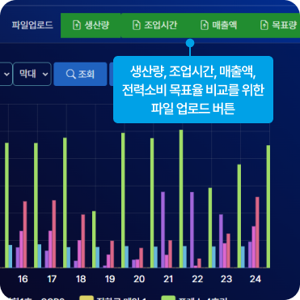

<details><summary>OCR 텍스트</summary>

```
"ae
```

</details>

### 이미지: `16_6.png`

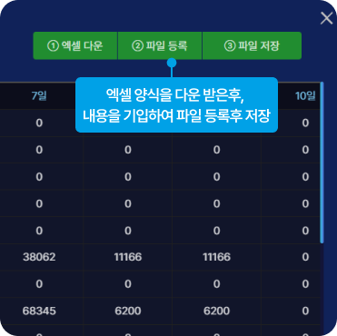

<details><summary>OCR 텍스트</summary>

```
11166

11166

38062

6200

6200

68345
```

</details>

### 이미지: `16_7.png`

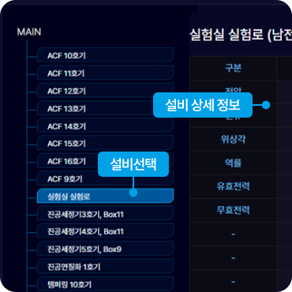

<details><summary>OCR 텍스트</summary>

```
ACF 10호기

ACF 11:71

ACF 12071

ACF 13871

ACF 14871

ACF 15971

ACF 16호기

ACF 9호기
wee OO

8349713871, 8001

진공세정기4호기, 0001

전공세정기5호기, 8049

진공연질화1호기

멤퍼링 10871

실험실 실험로 (남전

구분
```

</details>

---

## #slide9 — 보고서

**항목:** 종합보고서 / 전력요금보고서

종합보고서
 공정 그룹 및 설비별로 선택 기간의 전력 사용량 보고서를 다운 받을 수 있습니다. 결과는 날짜별 표 형식으로 보여지며, 전력량, 최대수요, 전력요금, 부하율 등이 표시 됩니다. 생산량 정보를 업로드시 생산량대비 전력요금 결과가 함께 표시됩니다.
 전력요금보고서
 공정 그룹 및 설비별로 전력 사용량과 사용 요금과 관련된 보고서를 다운 받을 수 있습니다. 해당 결과는 요약본과 함께 제공되며, 날짜 및 1시간 단위별로 전력 사용 요금이 표 형식으로 제공됩니다.

### 이미지: `19_1.png`

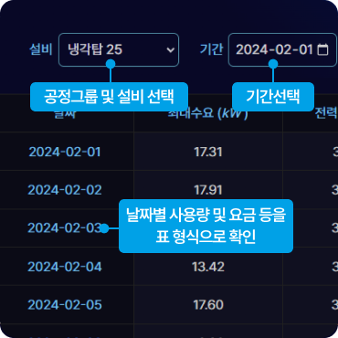

<details><summary>OCR 텍스트</summary>

```
설비 | 냉각탑 25 | 기간| 2024-02-010

수요 (<
2024-02-01 17.31
2024-02-02 17.91
2024-02-0
2024-02-04 13.42

2024-02-05 1760
```

</details>

### 이미지: `19_2.png`

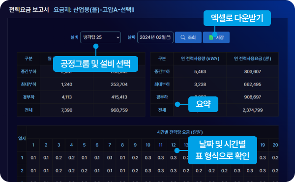

<details><summary>OCR 텍스트</summary>

```
전력요금 보고서 요금제: 산업용(을)-고압&-선택|!
설비 | 냉각탑 25 »| 날까 | 2024년 02월2 —

ae 월 구분 연 전력사용량 (kW) 연 전력사용요금 (&)
중간부하 = 「 중간부하 5,463 803,607
최대부하 1240 253,704 최대부하 3,238 662,495

경부하 4n3 415,413 경부하 908.697

전체 7390 968,759 전체 9 2,374,799
시간별 젼력량 요금 (만원)
일자
12 1 19 20

2 3 4 5 6 7 8 9 0 1
03 02

1 01 01 02 02 01 OF 01 01 02 03 03 03 0:

2 01 01 02 02 02 01 01 01 02 03 03 03 02 02 02 02 03 03 03 02
```

</details>

---

## #slide9-1 — 보고서

**항목:** 온실가스배출보고서 / 기간별 전력사용량 / 설비별 전력상세정보

온실가스배출보고서
 공정 그룹 및 설비별로 선택 월에 대한 전력 사용량과 온실가스배출량을 다운 받을 수 있습니다. 해당 결과는 요약본과 함께 제공되며, 날짜 및 1시간 단위별, 부하별로 표 형식으로 제공됩니다. 
 기간별 전력사용량
 공정 그룹 및 설비별로 선택 기간 단위에 대한 보고서를 다운 받을 수 있습니다. 시간, 일, 월 단위로 선택 가능합니다.
 설비별 전력상세정보
 설비별로 필요한 항목을 선택하여 상세 보고서를 제공합니다. 제공되는 항목에는 전압, 전류, 전력, 전력량, 무효전력량, 역률, 전력요금, 누적요금이 있습니다.

### 이미지: `19_3.png`

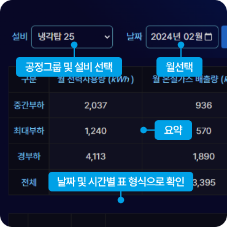

<details><summary>OCR 텍스트</summary>

```
설비 | 냉각탑 25 이 날짜 ‘202444 02810 |

출량 (/

문 선 ) 꾼질가스

중간부하 2.037 936
```

</details>

### 이미지: `19_4.png`

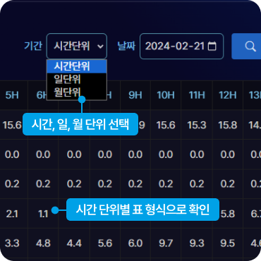

<details><summary>OCR 텍스트</summary>

```
기간 | 시간단위 | 날짜| 2024-02-210 ey

일단위
하 See 9H 10H NIH 12H 13
= 156 153 158 14,
00 00 00 00 00 00 00 Oo
02 02 O02 O02 02 O02 O02 0

0 000

48 44 56 60 97 93 95 A
```

</details>

### 이미지: `19_5.png`

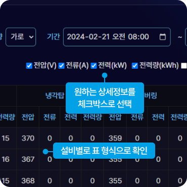

<details><summary>OCR 텍스트</summary>

```
| 가로 v| 기간

2024-02-21 오전 08:00 0 -|

MV) 2 전류(4) MAA (kW) w AS (kWh) 를
```

</details>

---

## #slide10 — 환경설정

**항목:** 대시보드 화면설정 / 사용자관리 / 알람설정

대시보드 화면설정
 첫 화면인 대시보드 화면을 설정합니다. 1줄에 보여질 위젯 갯수선택 및 체크박스로 보이기 숨기기를 설정할 수 있고, 순서 입력창에 숫자를 입력하여 오름차순으로 위젯 순서를 바꿀 수 있습니다. 
 사용자관리
 시스템 사용자를 직접 추가하실 수 있으며, 추가 팝업창에서 권한 및 사용자 정보를 입력한 후 저장합니다.
 알람설정
 각 설비별로 설정 값 이상의 변도 사항이 있을 경우 SMS로 알람이 발송됩니다. 알람 항목에 체크를 해제하면 알람이 발송되지 않습니다.

### 이미지: `21_1.png`

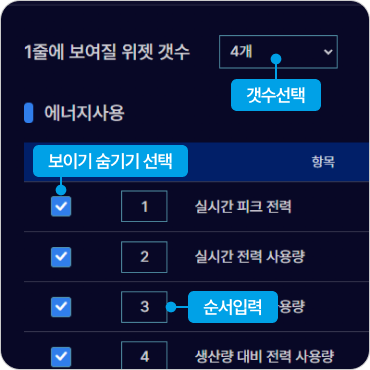

<details><summary>OCR 텍스트</summary>

```
/

1줄에 보여질 위젯 2+ 4개 | v
| 에너지사용
비베 7

: > a=

4 생산량대비전력사용량 /

1 실시간 피크 전력

2 실시간 전력 사용량
```

</details>

### 이미지: `21_2.png`


<details><summary>OCR 텍스트</summary>

```
권한
이름
비밀번호

알람토큰

사용자관리

ㅣ 일반사용자
```

</details>

### 이미지: `21_3.png`

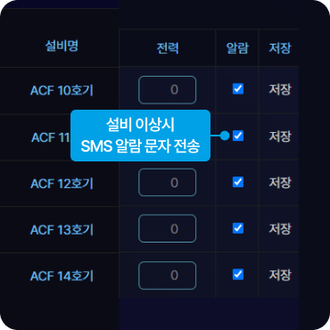

<details><summary>OCR 텍스트</summary>

```
설비명

ACF 10호기

전력

Lo)

알람

ACF 12호기

ACF 13호기

ACF 14호기

=
=
Ｌ 8)

저장

저장

저장

저장

저장

저장
```

</details>

---

## #slide10-1 — 환경설정

**항목:** 노드 게이트웨이 / 노드 게이트웨이 - 추가 팝업창

노드 게이트웨이
 GATE
 : 게이트의 고유번호이며 변경할 수 없음
 이름
 : 게이트 이름
 IP/PORT
 : 게이트가 서버와 통신할 때 사용한 인터넷 접속 주소
 IP AToN
 : IP 정수 변환값
 node1 ~ 10
 : 해당 노드번호에 설정된 제어계측 종류
 노드 게이트웨이 - 추가 팝업창
 이름
 : 관리용 이름 설정
 GATE
 : 중복되지 않는 고유번호이며, 설정된 값으로 서버와 연결된 릴레이와 에어의 목록이 아래에 나타남
 IP/PORT
 : 게이트웨이가 서버와 통신이 되면 자동으로 입력됨
 사용여부
 : 사용안함 선택시 서버와 통신이 되어도 데이터 등록이 되지 않음
 node1 ~ 10
 : 1 ~ 10 노드에 연결할 단말기 종류를 선택함

### 이미지: `21_4.png`

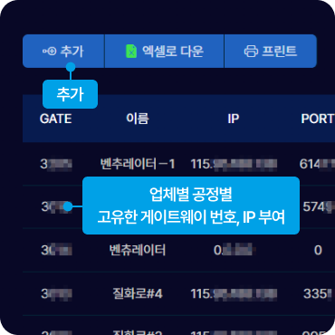

<details><summary>OCR 텍스트</summary>

```
GATE 이름 IP PORT

33206 벤추레이터-1 115. SA 6146

5746

Ks 벤츄레이터 Omid 0

6 질화로84 7115.09 6 335!

~_ Tice un ear 일으 amar
```

</details>

### 이미지: `21_4_2.png`

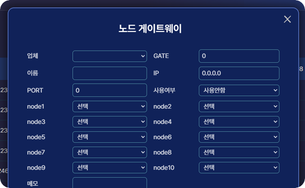

<details><summary>OCR 텍스트</summary>

```
업체

이름

ㅁ0061

ㅁ0063

PEE

선택
선택

선택

선택

선택

노드 게이트웨이

| GATE

IP

사용여부

| node10

0.0.0.0

선택

선택

선택

선택

선택
```

</details>

---

## #slide10-1-1 — 환경설정

**항목:** 게이트웨이 제어

게이트웨이 제어
 GATE
 : 노드 게이트웨이의 고유번호
 모드
 : 터치하면 수동/자동(초록색)으로 전환됨. 
피크제어가 자동모드일때 제어설정이 수동이면 피크 제어시 제어를 하지 않음
 순위
 : 피크 우선순위 자동제어 할 때 오름차순 순서로 제어함
 노드
 : 노드 게이트웨이 설정에서 사용한 1 ~ 10 사이의 노드 번호
 제어계측
 : 설정된 제어타입
 전압/전류
 : 전력계측 정보를 설정했을 때 정보가 실시간으로 표시됨
 온도
 : 온도계측 정보를 설정했을 때 정보가 실시간으로 표시됨
 상태
 : 미제어(흰색) - 현재 제어 중이 아닐 때
 제어(붉은색) - 현재 제어 중일 때
 제어
 : 터치로 제어/제어해제 요청 가능. 8초에 한번씩 요청 할 수 있으며, 
마지막 수신시간이 초록색일때는 제어불가 상태임.
 제어 진행 중일 때 통신이 2분이상 끊어지면 자동으로 미제어 상태로 변경됨
 현재값
 : 제어계측 설정값에 Relay 로 되어 있을경우 4 ~ 20mA 값이 출력됨. 
구형은 제어중 일때만 실시간 데이터가 표시됨
 출력
 : 현재 제어를 하였을 경우 적용되는 출력 설정값(0 ~ 100%)
 피크
 : 피크제어때 적용될 출력 설정값. 
최적화 제어시 출력값이 계속 변경되어 제어를 하기 때문에 필요한 항목임
 마지막수신
 : 최근통신을 주고받은 시간으로, 30초 이상 지연되면 초록색으로 표시됨

### 이미지: `21_5_01.png`

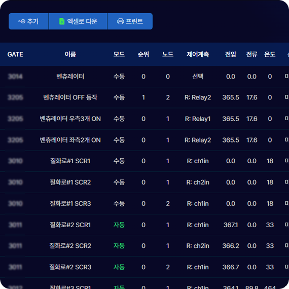

<details><summary>OCR 텍스트</summary>

```
GATE 이름

yous 벤츄레이터
3208 벤츄레이터 OFF 동작 1 2 RRelay2 3655 176 0
3208 벤츄레이터 PASH ON R:Relayl 365.5 176 0
3208 벤츄레이터 좌측2개 ON 0 1 R:Relay2 365.5 176 0
질화로#1 5001 0 1 R: chiin 00 00 18

질화로#1 SCR2 0 1 R: ch2in 00 #400 18

30 0 0 0 0 0 ORR

wow

ow

ow 질화로#1 SCR3 0 2 R: chtin 00 00 18
yon 질화로#2 SCR1 자동 0 1 R: chiin 3671 0.0 33
yon 질화로#2 SCR2 자동 0 1 R:ch2in 366.2 0.0 33
yon

질화로#2 SCR3 자동 0 2 R: chiin 366.7 0.0 33

=

ZXISLP wo Crp TLS. n 4 D* zahiin ALA 20202 ALA
```

</details>

---

## #slide10-1-2 — 환경설정

**항목:** 게이트웨이 제어 - 추가 팝업창

게이트웨이 제어 - 추가 팝업창
 업체
 : 업체가 선택되면 업체가 사용하는 게이트웨이 목록이 아래에 출력됨
 이름
 : 관리용 이름
 제어모드
 : 자동/수동 중에서 선택할 수 있으며, 
수동일 때는 피크자동제어시 제어하지 않음
 우선순위
 : 피크 우선순위 자동제어 할 때 오름차순 순서로 제어함
 게이트웨이
 : 연결할 게이트 번호를 입력
 게이트노드
 : 연결할 게이트 번호 1 ~ 10 을 입력
 기본온도
 : 설비관리 > 설비제어 그래프에서 기준이 되는 온도 정보이며, 
제어에 영향을 미치지 않음
 설비탭명
 : 설비탭명을 기준으로 쌍으로 설비관리 > 설비제어 설비목록이 출력되며 
설비디자인이 연속로 일때는
 설비탭명 기준으로 그룹으로 화면에 출력됨
 온도계측
 : 등록된 온도계측기를 선택하여 전력량관리 화면의 15분별 온도정보를 
표시하거나 최적화제어
 그래프에 온도계측정보를 실시간으로 표시할 수 있음
 전력계측
 : 등록된 전력계측기를 선택하여 제어설비와 연동하여 
실시간 전력/전류 정보 확인 가능
 제어계측
 : 사용할 제어계측 타입을 선택하여 
실시간 전류값 표시와 제어상태 정보 확인 가능
 설정타입
 : 출력 설정값을 변경할 때 해당 제어 설정타입을 선택함
 설정값
 : 제어 중일 때 사용 되는 출력 설정값 (0 ~ 100%) 이며, 
설정값 변경은 원하는 수치를 입력 후 설정값
 옆 기어모양의 을 터치하면 
통신 가능 상태일 때 제어설비에 적용이 됨
 제어타입
 : 제어를 위한 정확한 제어타입을 선택해야 함 (중요)
 강제복귀시간
 : 0값 이상일 때만 동작하며 최대 제어가능 시간이며, 단위는 초단위.
 [ 예시 ] 120일 경우 제어가 진행 되고 피크 상태여도 120초 후 제어해제 됨. 
수동제어일 때도 120초 후 제어해제 됨
 제어휴지시간
 : 0값 이상일때만 동작하며 자동제어 할 때 
제어 종료 후 해당시간이 지난 후 제어가 시작됨. 
 단위는 초단위
 기본용량
 : 정확한 제어절감 정보를 계산하기 위해 설비의 기본용량 정보를 입력함
 설비디자인
 : 설비관리 > 설비제어 화면에서 관리할때 
설비의 화면 디자인을 선택하면 목록에 나타남

### 이미지: `21_5_02.png`

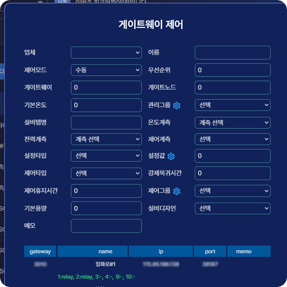

<details><summary>OCR 텍스트</summary>

```
게이트웨이 제어

업체
제어모드 수동
게이트웨이 0
기본온도 0
설비탭명
전력계측 계측 선택
설정타입 선택
제어타입 선택
제어휴지시간 0
기본용량 0
메모
gateway name
에여 질화로#1

Trelay, 2:relay, 3:-, 4:-, 9:-, 10:-

이름
우선순위

게이트노드
관리그룹 &
온도계측
제어계측
MB <2
강제복귀시간
제어그룹 85

설비디자인

선택
계측 선택
선택

선택
선택

1:
```

</details>

---

## #slide10-1-3 — 환경설정

**항목:** 시퀀스 제어

시퀀스 제어
 냉난방 등 연속적인 동작과 제어가 필요한 설비에 대해 제어가 가능합니다. 
 [시퀀스 제어 상단 버튼항목]
 추가
 : 새로운 시퀀스 제어 설정화면을 팝업함
 제어모드
 : 시퀀스 제어 전체의 제어모드를 수동/자동으로 전환함
 전체OFF
 : 시퀀스 제어 전체를 OFF(제어) 요청함
 전체ON
 : 시퀀스 제어 전체를 ON(제어해제) 요청함
 엑셀
 : 엑셀파일 형식으로 시퀀스 제어 목록을 저장함
 [주요항목]
 제어모드
 : 터치하면 수동/자동으로 전환됨
 우선순위
 : 피크 우선순위 자동제어 할 때 오름차순 순서로 제어함
 제어
 : 터치하면 제어/제어해제 요청함
 상태
 : 미제어(흰색) - 현재 제어 중이 아닐때/ 제어(붉은색) - 현재 제어 중일 때
 제어가능여부
 : 16초 이상 통신지연될 경우 제어불가능으로 표시됨
 전압/전류
 : 전력계측 정보를 설정했을 때 정보가 실시간으로 표시됨

### 이미지: `21_6_01.png`

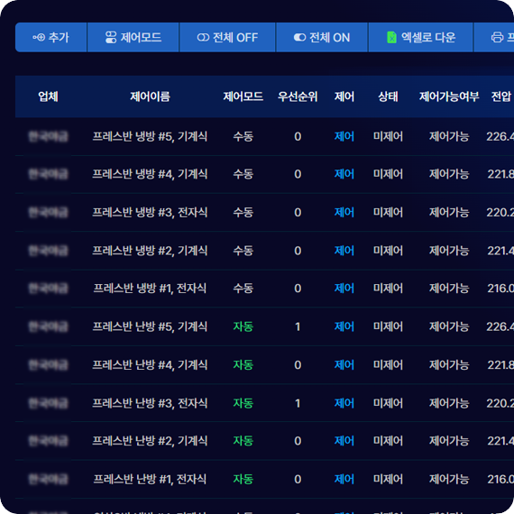

<details><summary>OCR 텍스트</summary>

```
제어이름 제어모드 Pee 제어 . 상태 제어가능여부 전압

프레스반 냉방 #5, 기계식 제어 미제어 제어가능 226.

ah

프레스반 냉방 #4, 기계식 0 제어 미제어 제어가능 221.8

프레스반 냉방 #3, 전자식 0 제어 미제어 제어가능 220.2
프레스반 냉방 #2, 기계식 0 제어 미제어 제어가능 2214
프레스반 냉방 #1, 전자식 0 제어 미제어 제어가능 . 216.0
프레스반 난방 #5, 기계식 제어 미제어 제어가능 226.
프레스반 난방 #4, 기계식 0 제어 미제어 제어가능 2218
프레스반 난방 #3, 전자식 1 제어 미제어 제어가능 220.2

프레스반 난방 #2, 기계식 0 제어 미제어 제어가능 221.4

PELLETS

oom 00000 0 0

프레스반 난방 #1, 전자식 0 제어 미제어 제어가능 . 216.0
```

</details>

---

## #slide10-2 — 환경설정

**항목:** 시퀀스 제어 - 추가 팝업창

시퀀스 제어 - 추가 팝업창
 업체
 : 업체를 선택했을 때 등록된 도면그룹과 제어기 목록을 얻을 수 있음
 도면그룹
 : 해당업체로 등록된 도면을 선택할 수 있으며, 
아이콘을 터치하면 도면을 관리할 수 있고, 
 도면정보는 현재 설비제어 > 냉난방제어 화면에서 제공되고 있음
 도면좌표
 : 출력된 도면의 위치를 터치하거나 직접 입력하면 제공되는 
도면정보에 시퀀스 제어설비의 위치를
 표시함
 냉난방
 : 냉방, 난방을 구분하게 되며, 
선택하지 않으면 냉난방제어 화면에 표시되지 않음
 제어이름
 : 시퀀스 제어를 관리하기 위한 이름
 제어모드
 : 수동일 경우에는 피크일때 제어하지 않으며, 
자동일 경우에는 피크제어 운전모드가 자동으로 설정되어 있으면 
 피크일때 제어 진행됨
 전력계측
 : 전압, 전류정보를 실시간으로 표시하기 위한 
전력계측단말기 선택부분
 우선순위
 : 피크 우선순위 자동제어 할 때 오름차순으로 제어함
 강제복귀시간
 : 0값 이상일때만 동작하며 최대 제어가능 시간임. 단위는 초단위
 [ 예시 ] 120일 경우 제어가 진행되고 피크 상태여도 120초 후 제어해제 됨. 
수동제어 일때도 120초 후 제어해제 됨
 제어휴지시간
 : 0값 이상일때만 동작하며 자동제어 할 때 제어 종료 후 
해당시간이 지난 후 제어가 시작됨. 단위는 초단위
 제어기
 : 등록된 노드제어를 선택할 수 있으며, 
선택하면 아래 설정 목록에 추가됨
 설정 - On순서
 : 낮은번호 순으로 On(제어해제)
 설정 - On딜레이
 : 현재 제어기가 On 이 된 후 다음 제어기를 
On 요청하기전 대기시간. 초단위
 설정 - Off순서
 : 낮은번호 순으로 Off(제어)
 설정 - Off딜레이
 : 현재 제어기가 Off 가 된 후 다음 제어기를 
Off 요청하기전 대기시간. 초단위
 설정 - 고정
 : On 일때는 Off 진행 후 해당 제어기만 다시 On 상태가 됨. 
Off 일때는 On 진행 후 해당 제어기만 다시 Off 가 됨

### 이미지: `21_6_02.png`

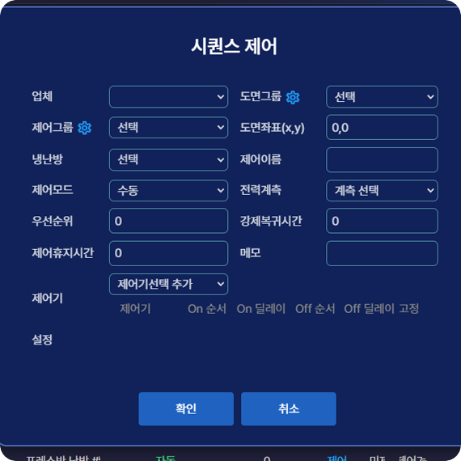

<details><summary>OCR 텍스트</summary>

```
AHA 제어

냉난방 선택 ~| 제어이름
제어모드 수동 ~| 전력계측 계측 선택 v

AMOR

제어기 00 순서 On 딜레이 Off eA Off 딜레이 고정

ㅜㅠ그| A ML LEE a TL n THA) nit dali.
```

</details>

---

## #slide10-2-1 — 환경설정

**항목:** RTU 관리 / RTU 관리 - 추가 팝업창

RTU 관리
 RTU
 : RTU의 고유번호로 변경할 수 없음
 이름
 : RTU 이름
 IP/PORT
 : RTU가 서버와 통신할 때 사용한 인터넷 접속 주소
 IP AToN
 : IP 정수 변환값
 마지막수신
 : 서버와 데이터를 주고받은 마지막 시간
 RTU 관리 - 추가 팝업창
 이름
 : 관리용 이름 설정
 RTU
 : 중복되지 않는 고유번호를 입력하며, 설정된 값으로 서버와 연결된 계측 단말기 목록이 아래에 나타남
 IP/PORT
 : RTU가 서버와 통신이 되면 자동으로 입력됨
 연결서버
 : 연결된 서버 이름이며 통신이 되면 자동으로 입력됨

### 이미지: `21_7.png`


<details><summary>OCR 텍스트</summary>

```
RTU 이름 IP Address

85 Bs 148 203. IT

Sha ends 146 203.

Shas pea 145 20330

atid Bea AA 9061 Tw ，훌
```

</details>

### 이미지: `21_7_1.png`

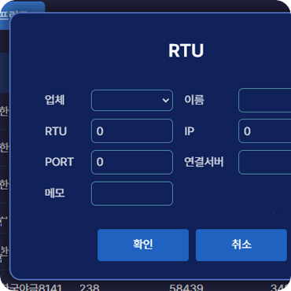

<details><summary>OCR 텍스트</summary>

```
KRRA20

t2.24A41 922

ian
```

</details>

---

## #slide10-2-2 — 환경설정

**항목:** 모드버스 계측

모드버스 계측
 제어장치와 시스템 간에 데이터를 교환하기 위해 
모드버스 프로토콜 방식을 사용하고 있습니다.
 LoadID
 : 계측단말기의 고유번호. 변경할 수 없음
 RTU
 : 서버통신을 위해 사용중인 RTU 고유번호
 vpn
 : 구형단말기가 서버와 통신할 때 사용하는 시스템 고유번호
 이름
 : 관리용 계측단말기 이름이며, 
계측량에 표시되는 화면에 모두 사용됨
 LoadNumber
 : 계측단말기를 구분하기위한 번호
 device
 : 계측단말기의 종류
 전압/전류/전력
 : 전력 계측단말기일 때 실시간 정보가 표시됨. 
릴레이 전류값을 위한 정보일 경우 전류값이 실시간으로 표시됩
 전력비교
전력비교 : 전압 x 전류 x √3 값 비교정보
 정보
 : 전력 계측단말기일 때 역률값이 표시됨. 
그 외는 해당 계측 정보의 주요값이 표시됨
 마지막 수신
 : 계측단말기의 최근 데이터 기록 시간
 자원
 : 릴레이 연동할때 사용되는 2채널 구분용
 자원ID
 : 릴레이 연동할때 사용되는 릴레이 고유번호
 자원범위
 : 릴레이 연동할때 사용되는 전류(4~20mA)가 해당 값으로 환산되는 
값의 범위

### 이미지: `21_8_01.png`

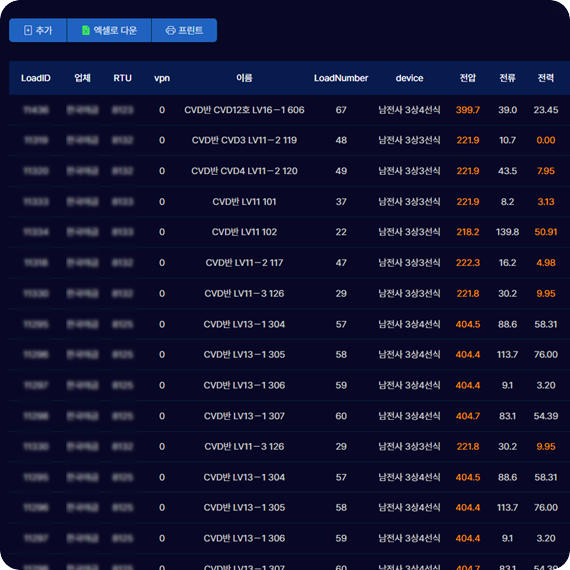

<details><summary>OCR 텍스트</summary>

```
11111111111111 111

PERCE EEE EEE EEE EEE 8

os

CvD¥t CVD12% LV16—1 606

CVD¥t CVD3 LV11—2 119

CvD¥t CVD4 LV11—2 120

CVD¥tLV11 101

CvD¥t LV11 102

Cvp¥t LV1—2 117

CvD¥t LV11—3 126

CvD¥t LV13—1 304

CvD¥t LV13—1 305

CVD¥t LV13—1 306

CVD¥tLV13—1 307

CvD¥t LV11—3 126

CvD¥t LV13—1 304

CvD¥t LV13—1 305

CVD¥t LV13—1 306

rrr 11709 — 4 수

LoadNumber — device

67

48

49

37

22

47

57

57

남전사 3상4선식

남전사 3상3선식

남전사 3상3선식

WHA 3상3선식

SMA 3상3선식

남전사 3상3선식

남전사 3상3선식

남전사 3상4선식

남전사 3상4선식

남전사 3상4선식

남전사 3상4선식

남전사 3상3선식

남전사 3상4선식

남전사 3상4선식

남전사 3상4선식

나져 우사시서시

399.7

2219

2219

2219

218.2

222.3

2218

404.5

404.4

404.4

4047

2218

404.5

404.4

404.4

ana?

139.8

16.2

1137

91

en

23.45

0.00

7.95

313

50.91

4.98

9.95

3.20

9.95

3.20

cara
```

</details>

---

## #slide10-2-3 — 환경설정

**항목:** 모드버스 계측 - 추가 팝업창

모드버스 계측 - 추가 팝업창
 LoadID
 : 계측단말기의 고유번호이며, 자동 입력되어 변경 불가함
 RTU
 : 서버 통신을 하기 위한 계측단말기에 설정된 RTU 고유번호
 VPN
 : 구형단말기가 서버와 통신할 때 사용하는 시스템 고유번호
 LoadNumber
 : 계측단말기에 설정된 값을 입력함. 되도록 중복되지 
않는 값을 사용함
 이름
 : 관리용 계측단말기 이름. 계측량에 표시되는 화면에 모두 사용됨
 도면그룹
 : 도면을 등록하여 계측단말기의 위치를 기록하는 곳
 도면좌표
 : 출력된 도면의 위치를 터치하거나 직접 입력하면 
제공되는 도면정보에 시퀀스 제어설비의 위치를 표시
 device
 : 계측단말기의 종류를 선택
 사용여부
 : 사용안함으로 선택하면 관련화면에 출력되지 않으며 
모드버스 목록에는 회색으로 나타남
 전압 보정치
 : 화면 표시를 위한 보정값이며 사용전력량 변화에는 관련 없음
 전력 보정치
 : 보정값을 수정하면 순시전력과 누적전력량에 변화가 
생기며 수정된 전후의 전력량에 차이가 발생함
 전류 보정치
 : 화면 표시를 위한 보정값이며 사용전력량 변화에는 관련이 없음
 서포트 분류
 : 릴레이 연동할때 사용되는 2채널 구분용
 서포트 ID
 : 릴레이 연동할때 사용되는 릴레이 고유번호
 서포트 MIN
 : 릴레이 연동할때 사용되는 전류(4~20mA)가 해당 값으로 
환산되는 값의 최소값
 서포트 MAX
 : 릴레이 연동할때 사용되는 전류(4~20mA)가 해당 값으로 
환산되는 값의 최대값
 ONLY전류
 : 전류 값만으로 전력량을 기록하기 위한 설정
 변압기
 : 예를 선택했을 때 전력 사용량 비교 화면에 포함되지 않음

### 이미지: `21_8_02.png`

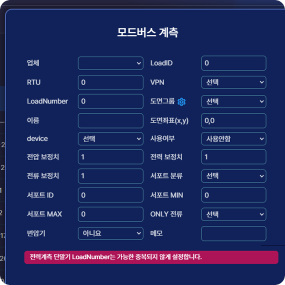

<details><summary>OCR 텍스트</summary>

```
업체

RTU
LoadNumber

이름

전압 보정치
전류 보정치
AXE ID

서포트 MAX

변압기

전력계측 단말기 LoadNumber= 가능한 중복되지 않게 설정합니다.

아니요

LoadID
VPN
도면그룹 &
도면좌표(<)
사용여부
전력 보정치
서포트 분류
서포트 MIN
ONLY 전류

메모

선택 `
선택 v
00

사용안함 v
1

선택 `
0

선택 ”
```

</details>

---

## #slide10-3 — 환경설정

**항목:** 실시간 데이터 / 통신상태 불량

실시간 데이터
 계측단말기와 서버통신 데이터 로그기록을 실시간으로 확인하기 위한 화면입니다.
 LoadID
 : 계측단말기의 고유번호
 GATE
 : RTU 번호/ GATE 번호
 LoadNo
 : 계측단말기의 구분용번호
 Len
 : 통신 데이터 길이
 Data
 : 실제 계측기에서 서버로 보내는 데이터값
 Type
 : 노드 파워, 노드 릴레이, 노드 에어 구분 정보
 Node
 : 설정된 Node 1 ~ 10 사이의 번호
 통신상태 불량
 분류
 : 계측설비와 제어설비를 분류함
 DEVICE
 : 설비의 고유번호 표시
 갱신일
 : 마지막 서버와 통신된 시간 
 위로 이동하기

### 이미지: `21_9.png`

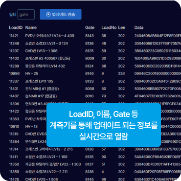

<details><summary>OCR 텍스트</summary>

```
LoadID Name Gate — LoadNo Len Data

11421 PVDY! 아이시스21424-4 439 843 36 202 ©—-24046808ABS04F12F8EOSFI
71348 소걸반소결321\21-37124 8136 48 202 3004606812037769170574
11297 CVDRILVI3~1306 85 59 202 360460223005920116034
11402 프레스반 02 400567 (BBS) 8009 30 202 160460649902105092006
11289 HAH HWEIELLVI4 402 B24 BB 202 580460080202035811014/
10896 HV-25 sue 9 226 090460200180000000000
11337 프레스반0/1105 81338 202 0680460162004045『28090
11401 견식148설버 (BBS) 8006 60 202 50046068880772야다008
11407 64048 #17 (WBS) 8010 79 202 4F04607EDD0307232A001
11396 연식3반3

71422 합금동유틸레

11363 000반혀우제

70970 HV-13

11319 CDE! CVD:

11384 연삭3반12

11314 -프레스반 고바아시19512-2 215 3904600680027『83757003
14411 ㆍ 소걸반소결35 1421-1109 0135 90 202 SAO4600CF804692BFDOSF
11350 가공동유틸리티콩/압7 1422-1 203 8137 51 202 33046007601011싸41285
71359 소그년 소규281422-2 211 e384 202 ©: 040460F 20FOSEBAFFOOSS:

11475

CVD 1V25-—-1505 8145 99 202 62304607 1IC406AR97FFO”
```

</details>

### 이미지: `21_10.png`

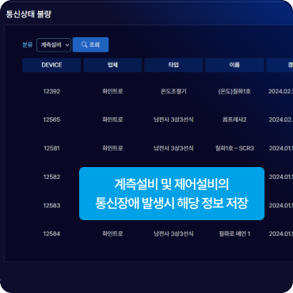

<details><summary>OCR 텍스트</summary>

```
12392

12565

12581

12582

12583

12584

화인트로

화인트로

화인트로

은도조절기

남전사 3삼3선식

BBA 3상3선식

SBA 3상3선식

이

(eae

mma

WiN2-SCR3

BRS 메인 1

2024.02:

2024.02.

2024013

2024011

2024.01

2024011
```

</details>

---

